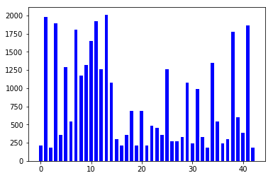
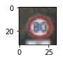
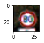
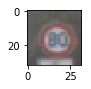
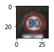
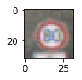
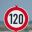
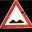
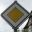
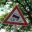

#**Traffic Sign Recognition** 

---

**Build a Traffic Sign Recognition Project**

The goals / steps of this project are the following:

* Load the data set (see below for links to the project data set)
* Explore, summarize and visualize the data set
* Design, train and test a model architecture
* Use the model to make predictions on new images
* Analyze the softmax probabilities of the new images
* Summarize the results with a written report


---
###Writeup / README

####1. Data Set Summary & Exploration

In this assignment, dataset from [INSITUT FUER NEUROINFORMATIK](http://benchmark.ini.rub.de/?section=gtsrb&subsection=dataset) is used.

I used the numpy library to calculate summary statistics of the traffic
signs data set:

* The size of training set is 34799
* The size of the validation set is 4410
* The size of test set is 12630
* The shape of a traffic sign image is (32, 32, 3)
* The number of unique classes/labels in the data set is 43

#### 2. Number of each labels
In the dataset, the number of each label is differnt, ranges from less than 200 to more than 2000.


###Design and Test a Model Architecture

####1. Data Preprocessing

As a first step, I enhanced the number of training images so that we can use more complicated data.
I used following 4 types of filtering:

1. Changing contrast (omitted becacuse of memory restriction)
2. Changing gamma
3. Additive white gaussian noise
4. Solt and pepper noise (omitted because of memory restriction)

Here is an example of a speed limit sign image before and after filtering. Unfortunately, the program was down when all of above 4 filtering are used. So I've decided to use only gamma correction and additive white gaussian noise.

###### Original Image


###### Contrast change [high/low]


###### Gamma correction [high/low]


As a last step, I normalized the image data to prevent gradient loss. In this assignment, I used simple normalization as below:

```python
def normalize(data):
    return (data.astype(int) - 128) / 128
```


####2. DNN Model Architecture

My final model consisted of the following layers:

| Layer         		|     Description	        					| 
|:---------------------:|:---------------------------------------------:| 
| Input         		| 32x32x3 RGB image   							| 
| Convolution 5x5     	| 1x1 stride, valid padding, outputs 28x28x10 	|
| RELU					|												|
| Dropout				| keep prob = 0.5								|
| Max pooling	      	| 2x2 stride,  outputs 14x14x10 				|
| Convolution 5x5	    | 1x1 stride, valid padding, outputs 10x10x32    |
| RELU					|												|
| Dropout				| keep prob = 0.5								|
| Max pooling	      	| 2x2 stride,  outputs 5x5x32 				|
| Fully connected		| Input=240, Output=160        					|
| RELU					|												|
| Fully connected		| Input=160, Output=43        					|
 
The code is written in cell #20

####3. Hyperparameters
To train the model, I used an following hyperparameters:

* learning rate = 0.001
* epochs = 10
* batch_size = 256
* dropout ratio = 0.5 for learning
* Optimizer = AdamOptiizer


####4. Optimization Approach

My final model results were:
* validation set accuracy of 0.930 
* test set accuracy of 0.938

If an iterative approach was chosen:

* At first, I used almost same architecture with LeNet.
* But it looked underfitting. So I tried to increase complexity of network architecture.
* As a result, network goes overfitting, so I regularized network using dropout. But it's not enough
* So I decided to increase my data, to avoid overfitting.
* I introduced 4 types of data augmentaton. Then the validation accuracy goes up more than 0.96, but memory used up and program stopped. So I reduced some of them

* I thought increasing dataset was the most effective major which I took. And my final architecture still overfits.


###Test a Model on New Images

####1. Chosen images

Here are five German traffic signs that I found on the web:

    


The fifth image might be difficult to classify because there is a tree behind the sign board. It might confuse the classifier.

####2. Classifiation Result

Here are the results of the prediction:

| Image			        |     Prediction	        					| 
|:---------------------:|:---------------------------------------------:| 
| speed limit (120km/h)	| speed limit (120km/h)						| 
| bumpy road     		| bumpy road								|
| roundabout			| roundabout								|
| priority	      		| priority Road					 			|
| slippery Road			| slippery Road      						|


The model was able to correctly guess 5 of the 5 traffic signs, which gives an accuracy of 100%. This compares favorably to the accuracy on the test set of 93%.

####3. Top five prediction for the each images

The code for making predictions on my final model is located in the 33th cell of the Ipython notebook.

###### First Image (Speed limit (120km/h))
For the first image, the model has quit high confidence. The top five soft max probabilities were as follows:

| Probability         	|     Prediction	        					| 
|:---------------------:|:---------------------------------------------:| 
| 9.99984503e-01         			| Speed limit (120km/h)  									| 
| 1.25254073e-05     				| Speed limit (100km/h) 										|
| 2.90273215e-06					| Speed limit (80km/h)											|
| 1.97651460e-08	      			| Speed limit (70km/h)					 				|
| 4.49095788e-10				    | Speed limit (30km/h)      							|

###### Second Image (Pedestrians)
For the second image, the model has relatively low confidence. The top five soft max probabilities were were as follows:

| Probability         	|     Prediction	        					| 
|:---------------------:|:---------------------------------------------:| 
| 7.95623899e-01         			| Bumpy road  									| 
| 1.34989634e-01     				| Traffic signals 										|
| 3.05744708e-02					| Wild animals crossing											|
| 1.79677382e-02	      			| Dangerous curve to the right				 				|
| 8.66960920e-03				    | Speed limit (30km/h)      							|

###### Third Image (Roundabout Mandatory)
For the third image, the model has quite high confidence. The top five soft max probabilities were were as follows:

| Probability         	|     Prediction	        					| 
|:---------------------:|:---------------------------------------------:| 
| 9.99999523e-01         			| Roundabout Mandatory  									| 
| 2.78984345e-07     				| Speed limit (80km/h) 										|
| 6.90753339e-08					| End of no passing by vehicles over 3.5 metric ... intersection											|
| 5.42083392e-08	      			| Keep right					 				|
| 2.41522233e-08				    | End of no passing      							|

###### Fourth Image (Priority road)
For the fourth image, the model has quite high confidence. The top five soft max probabilities were were as follows:

| Probability         	|     Prediction	        					| 
|:---------------------:|:---------------------------------------------:| 
| 9.99999642e-01         			| Priority road  									| 
| 1.66859493e-07     				| No passing for vehicles over 3.5 metric tons										|
| 1.37410993e-07					| End of all speed and passing limits											|
| 2.00002255e-08	      			| No passing					 				|
| 2.80819523e-09				    | End of speed limit (80km/h)     							|

###### Third Image (Slippery road)
For the fifth image, the model has quite high confidence. The top five soft max probabilities were were as follows:

| Probability         	|     Prediction	        					| 
|:---------------------:|:---------------------------------------------:| 
| 9.97136235e-0         			| Slippery road  									| 
| 1.84283464e-03     				| Wild animals crossing 										|
| 6.03827764e-04					| Dangerous curve to the left											|
| 3.88284650e-04	      			| No passing					 				|
| 1.09566363e-05				    | Right-of-way at the next intersection      							|

[[ 8  7  4  5  2]
 [22 26 31 20  1]
 [40  5 42 38 41]
 [12 10 32  9  6]
 [23 31 19  9 11]]